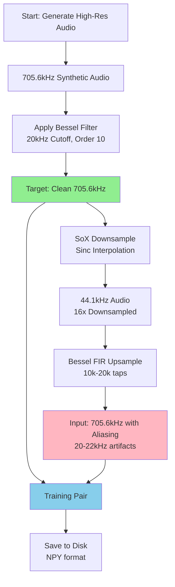
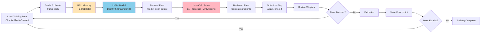
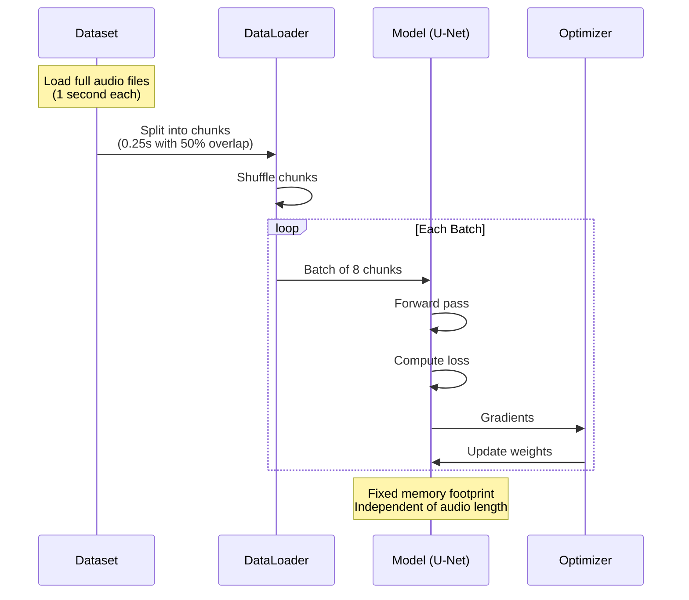
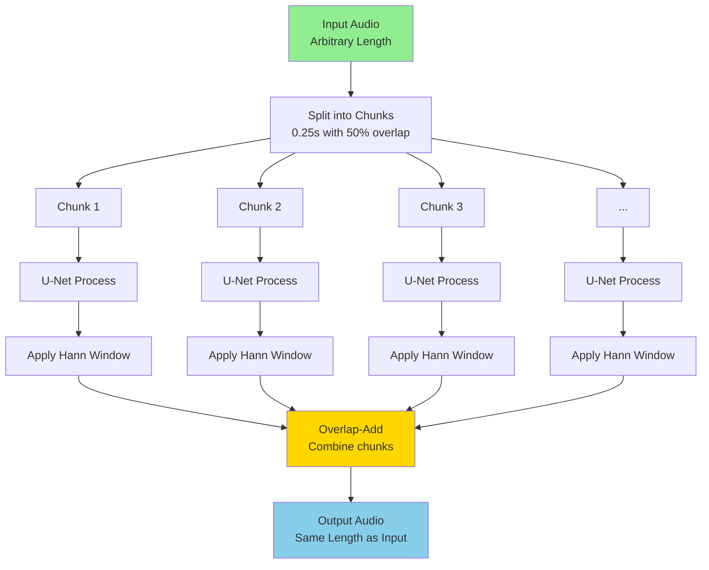
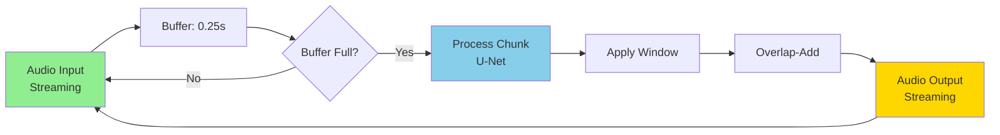
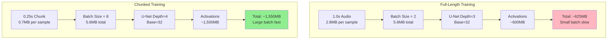
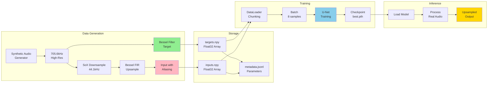

# Architecture Diagrams

This document provides visual representations of the Neural-DeRinger pipeline architecture.

## Table of Contents

- [Data Generation Flow](#data-generation-flow)
- [Training Pipeline](#training-pipeline)
- [Inference Pipeline](#inference-pipeline)
- [Memory Allocation](#memory-allocation)

---

## Data Generation Flow

### Overview Diagram



### Detailed Step-by-Step

1. **Generate Synthetic Audio (705.6kHz)**
   - Random oscillators (Sine, Square, Saw, Noise)
   - Random envelopes (ADSR)
   - Duration: 0.25s - 1.0s

2. **Apply Bessel Filter (Target Generation)**
   - Cutoff: 20kHz
   - Order: 8-12
   - Result: Zero overshoot, flat group delay
   - **Output**: Target (clean 705.6kHz)

3. **SoX Downsample (44.1kHz)**
   - Method: Sinc interpolation (high quality)
   - Ratio: 16× downsample (705.6kHz → 44.1kHz)
   - Result: Standard CD-quality audio

4. **Bessel FIR Upsample (Input Generation)**
   - Taps: 10k-20k
   - Method: Zero-stuffing + FIR convolution
   - Result: Aliasing artifacts in 20-22kHz range
   - **Output**: Input (705.6kHz with aliasing)

5. **Training Pair**
   - Input: Bessel-upsampled (with aliasing)
   - Target: Bessel-filtered (clean)
   - Format: NPY (float32)

---

## Training Pipeline

### Training Loop Diagram



### Memory Layout (Training)

```
GPU Memory (6GB available):

┌─────────────────────────────────────────────┐
│ Input Batch (8 × 0.25s @ 705.6kHz)   5.6MB │
├─────────────────────────────────────────────┤
│ U-Net Parameters (1.5M params)         6MB │
├─────────────────────────────────────────────┤
│ Gradients (same as params)             6MB │
├─────────────────────────────────────────────┤
│ Optimizer State (Adam: 2× params)    12MB │
├─────────────────────────────────────────────┤
│ Activations (intermediate outputs) 1,500MB │
├─────────────────────────────────────────────┤
│ Loss & Misc                           20MB │
└─────────────────────────────────────────────┘
Total:                                ~1,550MB

Remaining: ~4,500MB (buffer for spikes)
```

### Chunked Training Process



---

## Inference Pipeline

### Overlap-Add Inference



### Overlap-Add Visualization

```
Input Audio: [=====================================]
                     (10 seconds)

Split into Chunks (0.25s, 50% overlap):
[====]
    [====]
        [====]
            [====]
                ...

Process Each Chunk:
[OUT]
    [OUT]
        [OUT]
            [OUT]
                ...

Apply Hann Window:
 /\
   /\
     /\
       /\
         ...

Overlap-Add:
 /\
  +/\
    +/\
      +/\
        +...
= [=====================================]
         (10 seconds, smooth)
```

### Real-Time Processing



---

## Memory Allocation

### Scenario Comparison



### Memory Scaling

```
Chunk Size vs Memory Usage (Batch Size = 8):

1.0s  ┤ ██████████████████████ 5.6GB (batch=2 only)
      │
0.5s  ┤ ████████████ 2.8GB (batch=4)
      │
0.25s ┤ ██████ 1.5GB (batch=8) ← Recommended
      │
0.1s  ┤ ██ 0.9GB (batch=16)
      │
      └────────────────────────────────────────
       0GB    1GB    2GB    3GB    4GB    5GB    6GB
                    Available GPU Memory
```

### Model Architecture Impact

```
U-Net Configuration vs Memory (0.25s chunks, batch=8):

Depth=5  ┤ ██████████████ 3.2GB (risky)
Base=32  │
         │
Depth=4  ┤ ████████ 1.5GB (recommended)
Base=48  │
         │
Depth=4  ┤ █████ 1.1GB (balanced) ← Recommended
Base=32  │
         │
Depth=3  ┤ ███ 0.9GB (conservative)
Base=32  │
         │
Depth=3  ┤ ██ 0.7GB (minimal)
Base=24  │
         └────────────────────────────────────────
          0GB    1GB    2GB    3GB    4GB
                    GPU Memory Usage
```

---

## Pipeline Comparison

### Traditional Sinc Upsampling

```
Input (44.1kHz)
    ↓ Zero-stuffing
Intermediate (705.6kHz, zeros)
    ↓ Sinc FIR Filter (ideal frequency response)
Output (705.6kHz)
    ✓ Flat frequency response
    ✗ Severe ringing (Gibbs phenomenon)
```

### Minimum Phase FIR Upsampling

```
Input (44.1kHz)
    ↓ Zero-stuffing
Intermediate (705.6kHz, zeros)
    ↓ Minimum Phase FIR (640k taps)
Output (705.6kHz)
    ✓ Good frequency response
    ✓ Minimal ringing
    ✗ Nonlinear group delay (phase distortion)
    ✗ Very high computational cost
```

### Neural-DeRinger (Bessel FIR + NN)

```
Input (44.1kHz)
    ↓ Zero-stuffing
Intermediate (705.6kHz, zeros)
    ↓ Bessel FIR (10k-20k taps)
Aliased (705.6kHz with 20-22kHz artifacts)
    ↓ U-Net Neural Network
Output (705.6kHz)
    ✓ Flat group delay (from Bessel)
    ✓ Zero overshoot (from Bessel)
    ✓ Clean frequency response (from NN)
    ✓ Reasonable computational cost
    ✗ Requires training
```

---

## Training Data Flow



---

## Summary

Key architectural decisions:

1. **Data Generation**: Bessel FIR upsampling intentionally creates aliasing for NN to learn
2. **Training**: Chunked processing (0.25s) enables larger batch sizes on limited GPU memory
3. **Inference**: Overlap-Add (50% overlap, Hann window) for smooth boundaries
4. **Memory**: U-Net depth=4, base_channels=32 optimized for 6GB GPUs

This architecture achieves the "time-domain first" philosophy while maintaining practical computational constraints.
