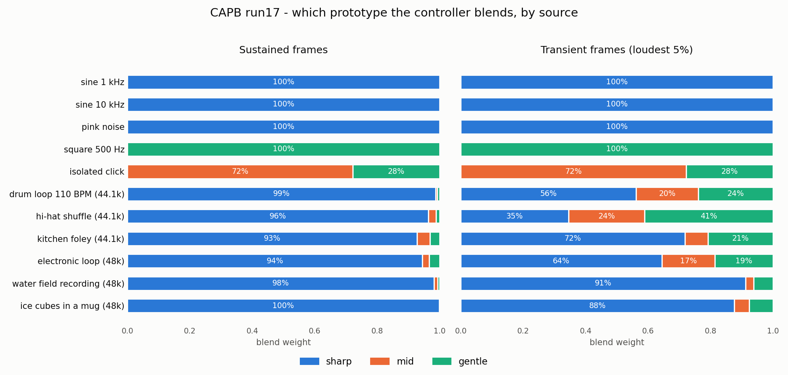

# 音源ごとのprototype選択

推奨checkpoint（run17、44.1 kHz系列と48 kHz系列）でcontrollerが実際に選ぶ混合比です。CAPB全体の概要は[README](../README.md)の図を参照してください。



左は定常フレーム（過渡強度が下位50%）、右は過渡強度が上位5%のフレームの平均です。いずれも無音フレームを除いています。実録音は先頭8秒をモノラル化して入力しました。

## 読み取り

- 定常toneとpink noiseは`sharp` 100%です。矩形波は`gentle` 100%、孤立clickは`mid` 0.72 / `gentle` 0.28です。
- 実録音の定常部は`sharp`が93〜100%を占めます（run16は79〜99%）。transient dwell射影が、打撃から5.8 ms以上離れた区間を`sharp`へ戻すためです。
- 打楽器系（ドラム、ハイハット、フォーリー）の過渡フレームでは`gentle`が21〜41%、`mid`が7〜24%です。run16の`gentle` 42〜60%に対し、打撃の±1.5 msを外れた区間が`mid`と`sharp`へ移っています。
- 水音やアイスキューブのように打点が緩い素材は、過渡フレームでも`sharp`が88〜91%を保ちます。

## 図の再生成

実録音は評価専用の素材で、リポジトリには含めません。対象ファイル名は`scripts/plot_readme_routing_figures.py`の`REAL_SOURCES`にあります。

```bash
uv run python scripts/plot_readme_routing_figures.py \
  --audio-dir <評価用録音のディレクトリ> \
  --output-dir docs/images
```

## さらに詳しい測定

| 内容 | 場所 |
|---|---|
| sweep spectrogram、THD、IMD、AMサイドバンド | `reports/release/run17_transient_dwell_20260922/visualization/distortion/` |
| impulse応答と長い尾 | `reports/release/run17_transient_dwell_20260922/visualization/impulse/` |
| gate結果一式 | `reports/release/run17_transient_dwell_20260922/gates/` |
