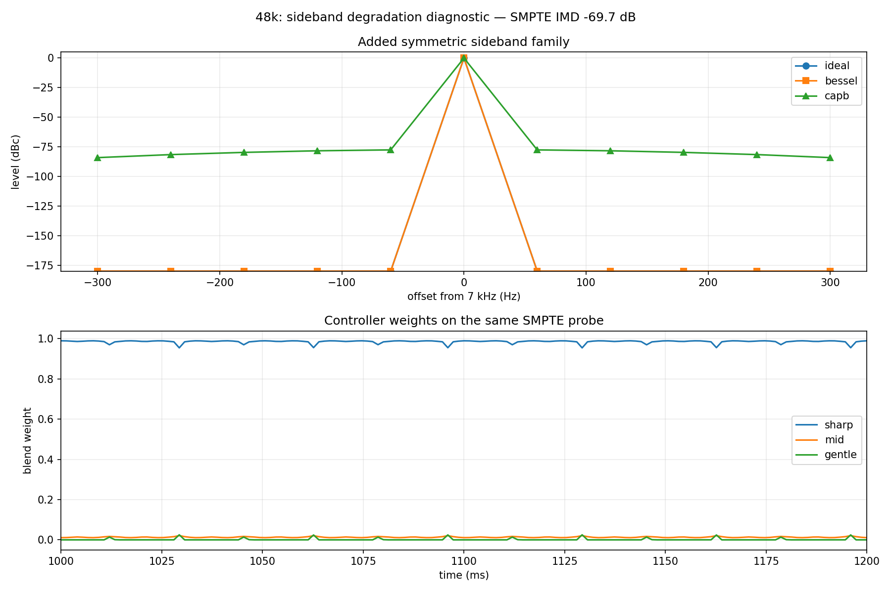
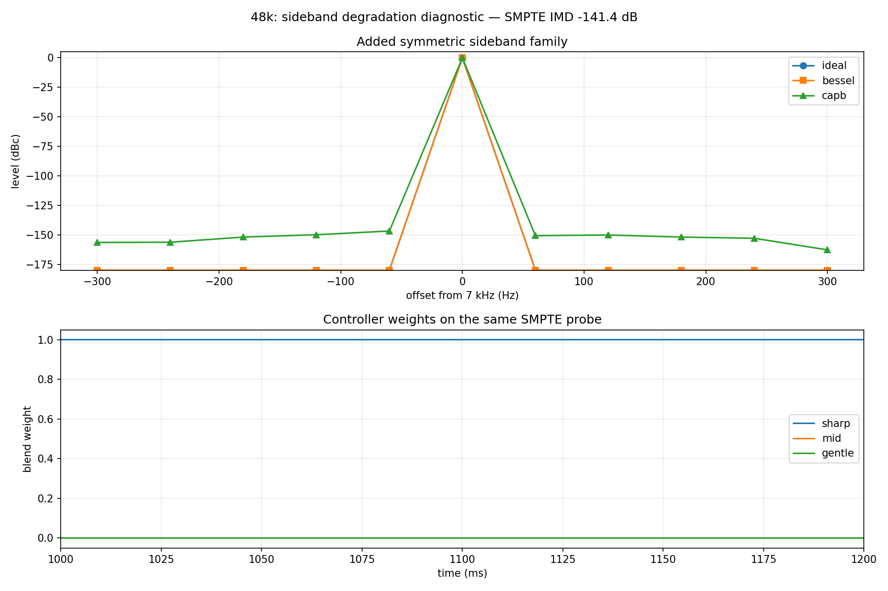
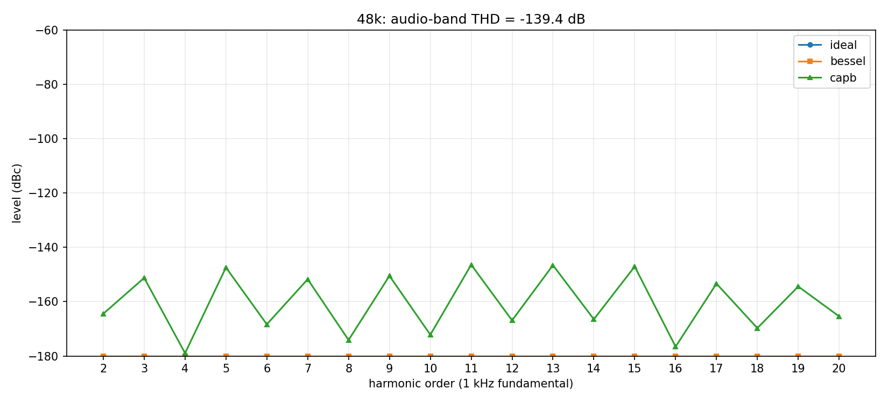
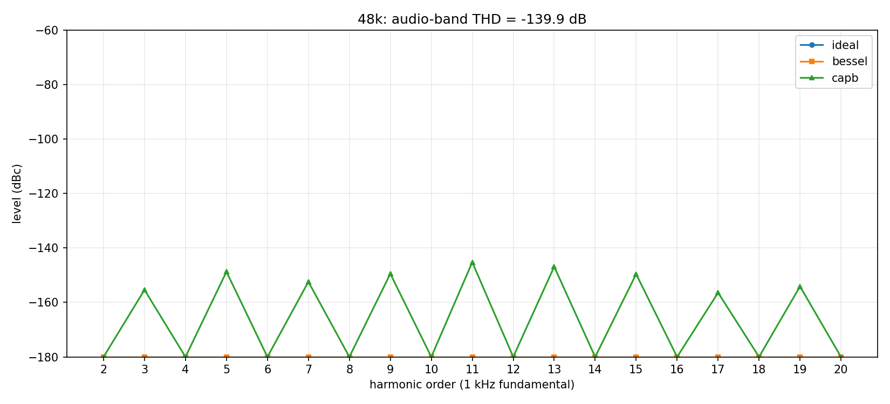
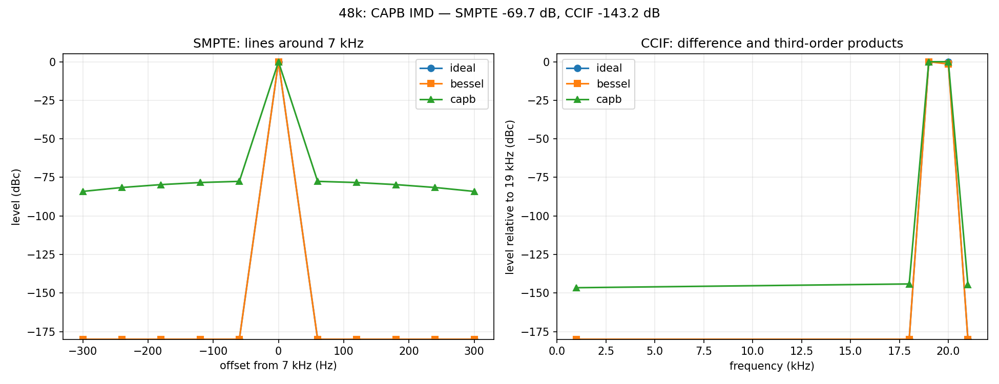
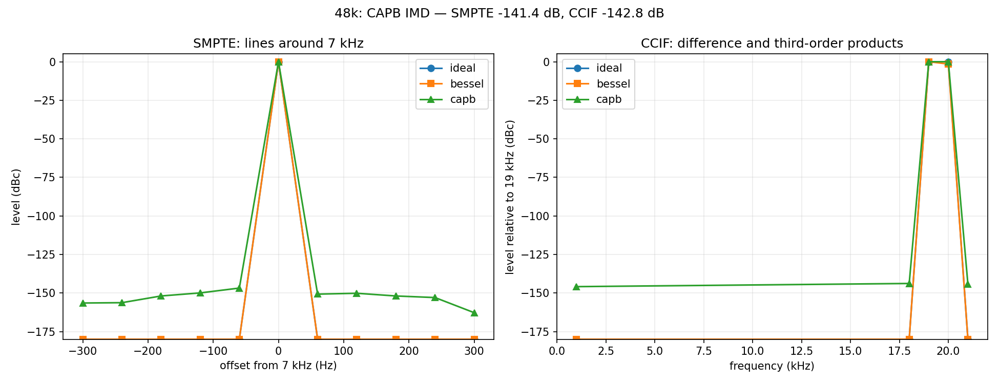

# 48 kHz stationary-modulation correction: before/after

The comparison uses the same three-second coherent probes and analyzes the
same center one-second region. Lower dBc is better. The gate-authoritative
result is [the final v4 report](../../probe_gates/capb_48k_run10_stationary_best_gate_v4/gate_report.md).

| Diagnostic | run9 baseline | run10 corrected | Change |
|---|---:|---:|---:|
| 1 kHz THD, harmonics through 20 kHz | -139.36 dB | -139.95 dB | -0.59 dB |
| SMPTE IMD, 60 Hz + 7 kHz | -69.70 dB | -141.43 dB | **-71.73 dB** |
| CCIF IMD, 19 + 20 kHz | -143.23 dB | -142.83 dB | +0.40 dB |
| Strongest added 10 kHz AM sideband | -164.72 dB | -161.76 dB | +2.96 dB |

The SMPTE defect was selective rather than broad nonlinear distortion. run10
removes the `7 kHz ± n·60 Hz` family by making the controller effectively
constant on the two-tone input; its sharp weight varies by less than
`7.2e-7`, compared with a run9 range of `3.5e-2`. The final SMPTE result is
31.43 dB below the -110 dB G9 limit while all existing time-, image-, gain-,
and low-band gates also pass.

| run9 baseline | run10 corrected |
|---|---|
|  |  |

| run9 THD/IMD | run10 THD/IMD |
|---|---|
|  |  |
|  |  |

The 44.1 kHz run9 checkpoint is retained only as a distortion diagnostic in
this report. It still fails its pre-existing G2/G2b acceptance gates, so this
change qualifies the 48 kHz family only and does not create a release pair.
