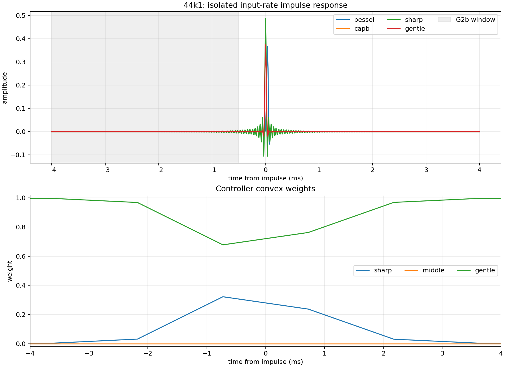
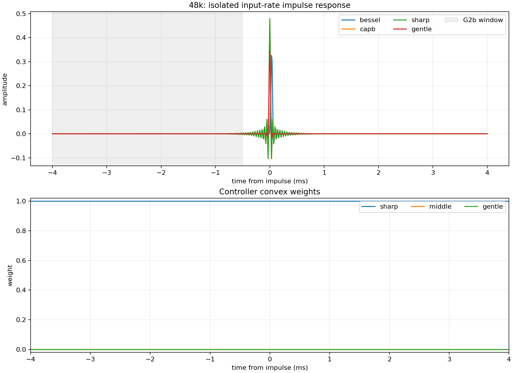

# CAPB impulse-response report

## 44k1

- Checkpoint: `data/checkpoints/capb/run11_44k1_optimized_20260829/capb_best.pt`
- CAPB G2b-window energy: 1.0466e-07
- Gentle G2b-window energy: 4.6435e-29
- Sharp G2b-window energy: 1.1398e-06

## 48k

- Checkpoint: `data/checkpoints/capb_48k/run10_stationary_20260829/capb_best.pt`
- CAPB G2b-window energy: 2.4733e-07
- Gentle G2b-window energy: 7.8101e-31
- Sharp G2b-window energy: 2.4733e-07

