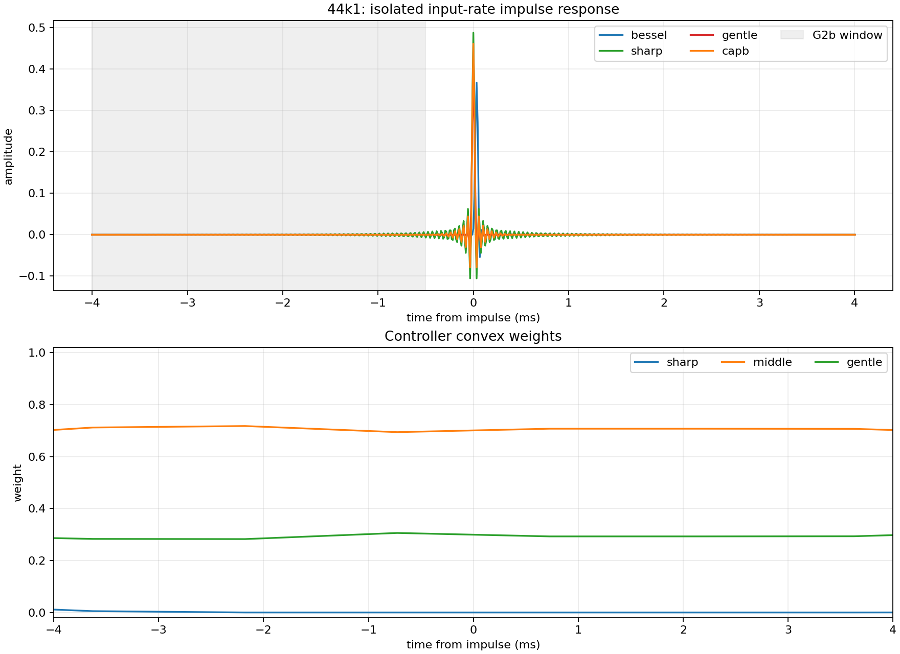
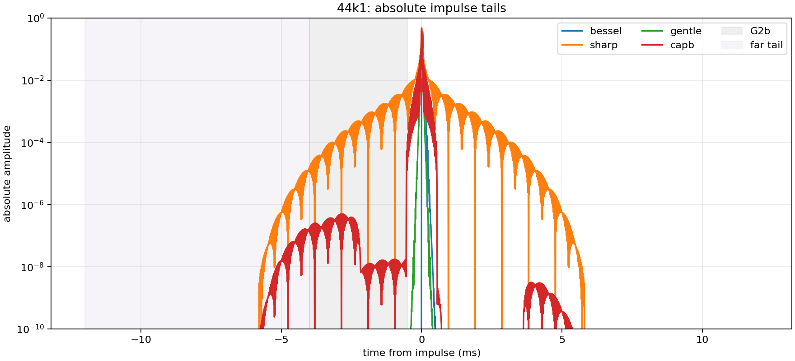
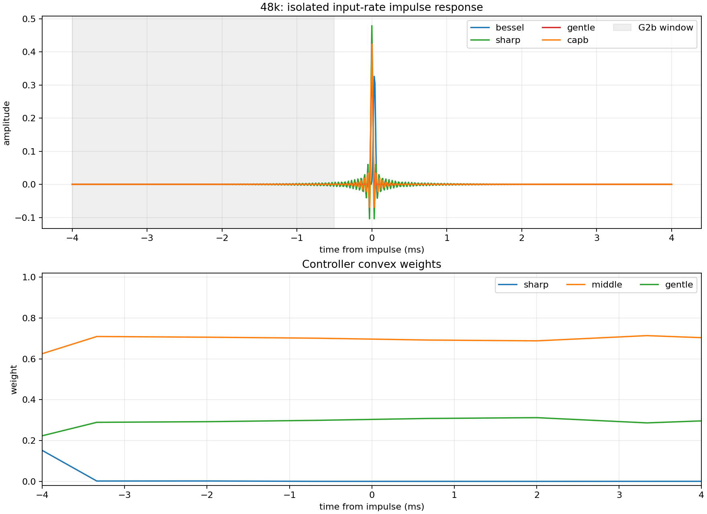
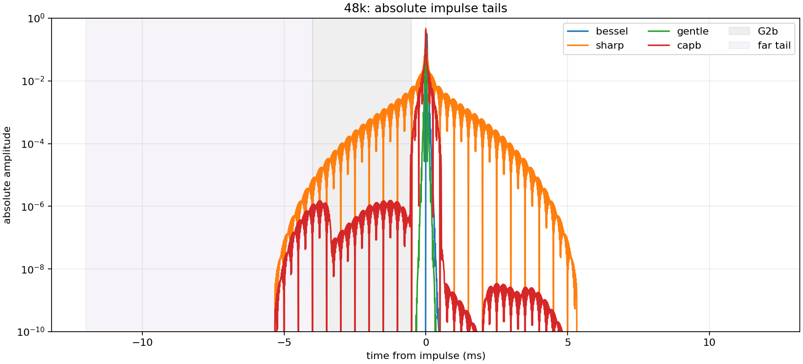

# CAPB impulse-response report

## 44k1

- Checkpoint: `/tmp/capb_v5b_ft_44_g0.3_s1234/capb_best.pt`
- CAPB G2b-window energy: 4.6199e-11
- Gentle G2b-window energy: 4.6435e-29
- Sharp G2b-window energy: 1.8970e-06

## 48k

- Checkpoint: `/tmp/capb_v5b_ft_48_g0.3_s1234/capb_best.pt`
- CAPB G2b-window energy: 3.2909e-11
- Gentle G2b-window energy: 7.8108e-31
- Sharp G2b-window energy: 1.5575e-06

