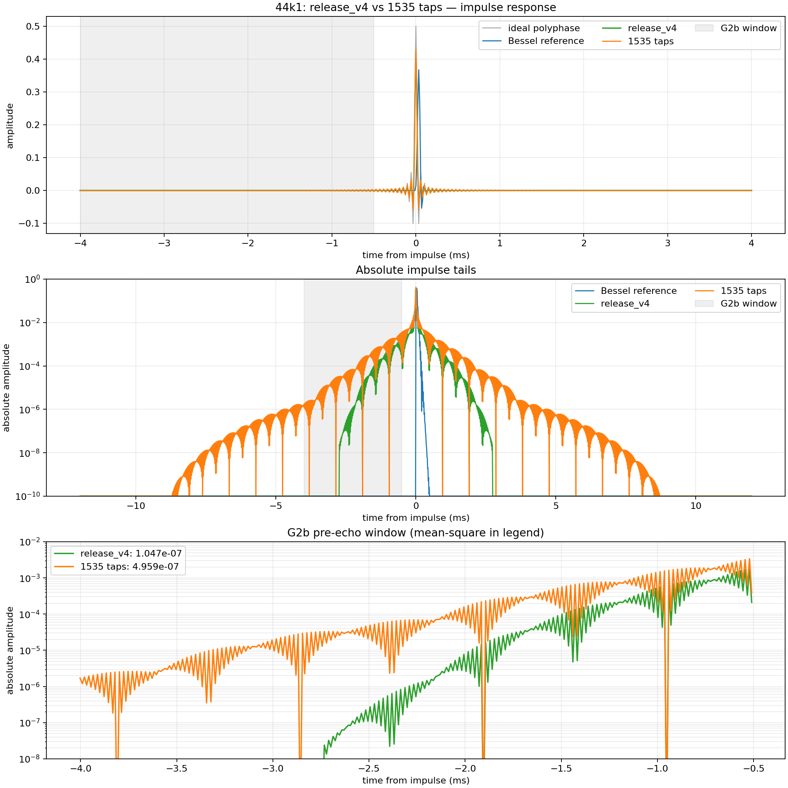
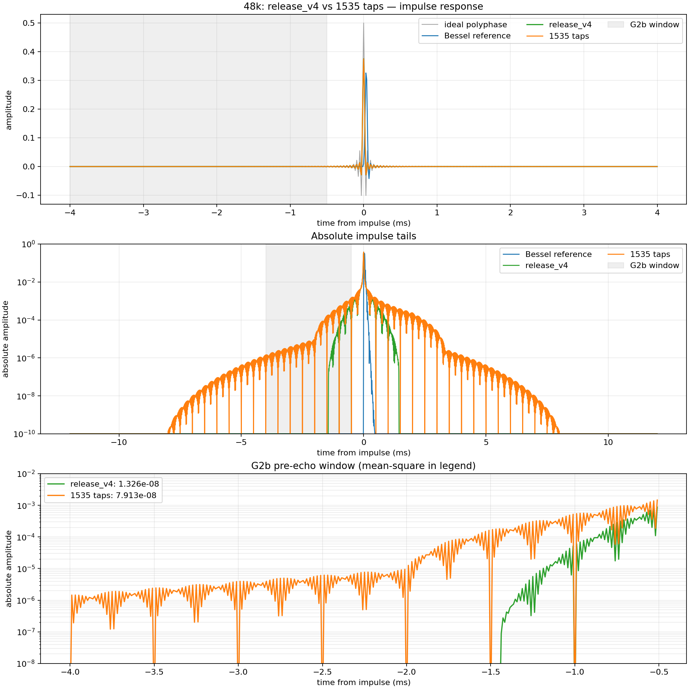

# 1535-tap CAPB research report

## Status

`long_sharp_1535_a120` は研究候補です。production採用品は引き続き
`release_v4` であり、このレポートはモデルやruntime既定値を変更しません。
候補checkpointもリポジトリには保存していません。

## Summary

1535 tapsはCAPB出力のworst G3 image peakを44.1 kHz系列で6.90 dB、
48 kHz系列で15.64 dB低減しました。一方、孤立インパルスのG2b pre-echoは
約6.8 dB増えました。絶対RMS振幅は44.1 kHzで`7.04e-4`、48 kHzで
`2.81e-4`です。

| Family | release G3 | 1535 G3 | Image improvement | release G2b | 1535 G2b |
|---|---:|---:|---:|---:|---:|
| 44.1 kHz | -112.35 dB | -119.25 dB | 6.90 dB | `1.047e-7` | `4.959e-7` |
| 48 kHz | -112.40 dB | -128.04 dB | 15.64 dB | `1.326e-8` | `7.913e-8` |

矩形波のCAPB plateau RMSはreleaseと実質同一です。定常区間ではcontrollerが
gentle側へルーティングするため、長いsharp FIRのテールは通常の矩形plateauへ
現れていません。

| Square probe | release_v4 | 1535 taps |
|---|---:|---:|
| 44.1 kHz / 100 Hz | `5.26041e-5` | `5.26041e-5` |
| 44.1 kHz / 500 Hz | `5.26044e-5` | `5.26044e-5` |
| 48 kHz / 100 Hz | `2.70231e-5` | `2.70218e-5` |
| 48 kHz / 500 Hz | `2.70232e-5` | `2.70232e-5` |

## Direct impulse comparisons

各図の上段はideal polyphase・Bessel・release・1535の線形表示、中段は
絶対振幅の対数表示、下段はG2b測定窓の直接比較です。

## Existing diagnostics

- [全候補trade-off](../../release/selection/tradeoff_comparison.png)
- [選定レポート](../../release/selection/selection.md)
- [1535 / 44.1 kHz矩形・sweep・歪み](../../release/comparison/long_sharp_1535_a120/44k1/)
- [1535 / 48 kHz矩形・sweep・歪み](../../release/comparison/long_sharp_1535_a120/48k/)

図は診断用です。正式な採否は変更していないworst-probe gateに従い、
1535 tapsは44.1 kHz G2b不合格のためproductionへ採用していません。
